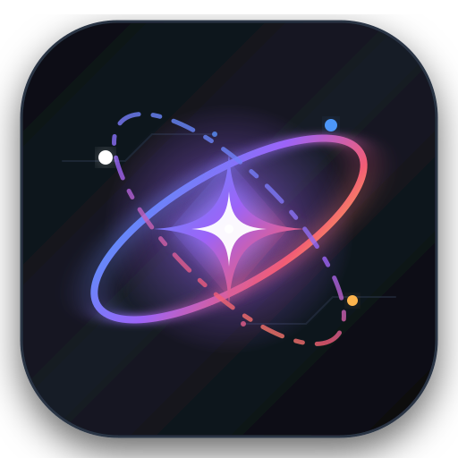

<div align="center">



# ⚡ Gemini Antigravity Bridge

**Turn Gemini Web into an Autonomous Local Coding Agent with 2M Context & Zero API Cost.**  
利用网页版 Gemini（免费 200 万超大上下文、0 Token 费用）直接驱动本地代码库的 Chrome 侧边栏 Agent 伴侣。

[](https://opensource.org/licenses/MIT)
[](https://developer.chrome.com/docs/extensions/mv3/)
[](https://nodejs.org/)
[](https://gemini.google.com)
[](#)

[English](#english) | [中文说明](#中文说明)

</div>

---

<a name="english"></a>
## 🌐 English

### Overview
**Gemini Antigravity Bridge** connects the web version of **Google Gemini (`gemini.google.com`)** with your local developer workspace through a lightweight local daemon and a sleek Chrome Side Panel extension. 

It provides an experience remarkably similar to **Google Antigravity / Cursor / Claude Code**, but without burning your API keys or incurring monthly token fees.

### ✨ Key Features
- **💎 100% Zero Token Cost**: Leverages your logged-in Google account on the Gemini web interface. No API charges, no credit card required.
- **🌌 2,000,000 Tokens Full-Repo Context**: Powered by [Repomix](https://github.com/yamadashy/repomix), automatically bundling and compressing your local codebase into a single structured snapshot that Gemini consumes in seconds.
- **🧠 Instant Project Cognitive Context**: One-click "建立项目认知" (Build Project Knowledge) button generates an architectural & dependency digest, helping Gemini deeply understand mature repositories in a single turn.
- **⚡ Auto-Apply to Disk**: Toggle on `⚡ 自动落盘` to have Gemini's suggested file patches (`SEARCH/REPLACE` & `FILE_NEW`) automatically applied directly to disk in real-time with automatic safety backups in `.gemini-bridge-backups/`. Manual **Accept** mode is also supported.
- **🖼️ Multimodal Screenshot & Image Pasting**: Direct `Ctrl+V` clipboard pasting or file upload for UI mockups, error screenshots, and design assets, rendering thumbnail previews and seamlessly injecting them into Gemini's multimodal vision engine.
- **⚡ Slash Command Skills (`/skill`)**: Type `/` in the prompt input to trigger a smart autocomplete popup loading local Antigravity / Spark skills from `~/.gemini/config/skills/`, dynamically injecting tailored system instructions into your conversation.
- **📁 Native Folder Picker & Multi-Workspace**: Pick directories with native OS dialogs or quick-switch between recent workspaces.
- **💾 Repo-Level Disk Persistence**: All session chats, diff cards, and terminal logs are stored right inside your project directory at `.gemini-bridge/sessions/<session_id>.json`.
- **💻 Integrated Terminal Execution**: Detects proposed bash/npm commands and runs them in a dedicated in-panel terminal with real-time output and full Windows UTF-8 (code page 65001) support.
- **🎯 Polished Modal & Drawer UX**: Full click-outside backdrop auto-dismiss and <kbd>Esc</kbd> key support for all drawer panels and skills popups.

### 🚀 Quickstart

#### 1. Start the Local Workspace Daemon
In the root directory, double-click:
```bat
start-daemon.bat
```
*(Or run `cd daemon && npm start` from your terminal)*  
The daemon will listen on `ws://127.0.0.1:3456`.

#### 2. Load the Chrome Extension
1. Open Chrome and navigate to `chrome://extensions/`.
2. Toggle on **Developer mode** (top-right).
3. Click **Load unpacked** (top-left) and select the `extension/` folder in this repository.

#### 3. Start Coding
1. Keep a tab of [gemini.google.com](https://gemini.google.com) open and logged in.
2. Click the extension icon in your Chrome toolbar to reveal the **Side Panel**.
3. Confirm the status shows `Online`. Type your coding request, view the generated Diff card, and hit **Accept** (or enable **⚡ 自动落盘** for fully automated changes)!

---

<a name="中文说明"></a>
## 🇨🇳 中文说明

### 项目简介
**Gemini Antigravity Bridge** 是一个连接 **Google Gemini 网页版** 与 **本地代码工作区** 的沉浸式 Chrome 侧边栏 Agent 伴侣。

无需购买昂贵商业 API，也不用担心超出 Token 额度，依托网页版 Gemini 免费赠送的高达 **200 万 Token（2M）超大上下文**，在侧边栏实现类似 **Cursor / Google Antigravity** 的全自动读写代码、多模态贴图诊断、运行终端命令与多项目管理闭环！

### ✨ 核心特性

- **💎 彻底 0 Token 消耗**：复用浏览器中已登录的 Gemini 网页算力，告别信用卡绑定与账单焦虑。
- **🌌 200 万 Token 全库投喂**：深度整合 `Repomix` 引擎，一键把本地几十万行源码打包成高压缩比 XML，秒级吃下中大型成熟项目。
- **🧠 一键建立成熟项目认知**：点击顶部「🧠 建立项目认知」，自动提取项目目录拓扑、依赖体系与核心逻辑骨架并投喂给 Gemini，免去反复向 AI 解释项目架构的繁琐操作。
- **⚡ 自动落盘覆盖更新 (Auto-Apply)**：支持勾选「⚡ 自动落盘」开关（状态持久化记忆）。开启后，Gemini 产出的任何代码修改（`SEARCH/REPLACE`）与新建文件（`FILE_NEW`）自动秒级写入本地磁盘并覆盖更新，无需手动反复点击确认，同时每次写入均在 `.gemini-bridge-backups/` 留下镜像快照，安全防翻车。
- **🖼️ 多模态截图与贴图支持**：在输入框内直接按 <kbd>Ctrl+V</kbd> 粘贴系统截图、设计图稿或点击图标上传多张本地图片；支持缩略图实时预览与单张删除，驱动 Gemini 视觉大模型进行 UI 像素级复刻与报错排错。
- **⚡ 本地技能斜杠指令 (`/技能名称`)**：在输入框键入 `/` 即可呼出本地技能列表（实时扫描 `~/.gemini/config/skills/` 内的所有技能规范），键盘 <kbd>↑</kbd> <kbd>↓</kbd> 挑选或鼠标点击，自动将对应的完整 System Instruction 与任务规范装载进 200 万上下文。
- **📁 原生系统文件夹选择器**：抽屉面板支持一键唤起 Windows 系统原生文件夹浏览窗口，秒级定位项目根目录，彻底告别繁琐的手动输入绝对路径。
- **💾 工程级本地磁盘持久化**：所有对话历史、Diff 卡片、终端日志严格保存在当前项目根目录的 `.gemini-bridge/sessions/` 下，与工程代码同生共死，天然支持 Git 版本管理与多项目隔离。
- **💻 极客终端命令执行**：自动识别 AI 生成的运行命令（如 `npm run dev`、`npm test`），提供黑底绿字的专属控制台，支持 Windows UTF-8 代码页强制转换，彻底杜绝中文乱码。
- **🎯 丝滑抽屉与弹窗交互**：项目管理抽屉、历史会话抽屉、技能弹窗均支持点击外部暗色遮罩自动收起、支持 <kbd>Esc</kbd> 快捷键退出，操作随心所欲。

### 🚀 三步极速上手

#### 第一步：启动本地守护进程 (Daemon)
在项目根目录下，双击运行：
```bat
start-daemon.bat
```
*(或者进入 `daemon` 目录执行 `npm start`)*  
控制台将输出：`🚀 Gemini-Antigravity Local Daemon Starting... 🔌 ws://127.0.0.1:3456`

#### 第二步：在 Chrome 中加载扩展程序
1. 打开 Chrome 浏览器，访问：`chrome://extensions/`
2. 打开右上角的 **【开发者模式】**。
3. 点击左上角 **【加载已解压的扩展程序】**，选中本项目中的 `extension` 目录。

#### 第三步：开启日常开发
1. 在浏览器标签页中打开并登录 [gemini.google.com](https://gemini.google.com)（后台常驻即可）。
2. 在 Chrome 工具栏右上角点击扩展图标展开 **Side Panel（侧边栏）**。
3. 看到顶部显示 `🟢 在线` 后，即可开始探索：
   - 现有成熟项目：点击 **「🧠 建立项目认知」** 快速建立上下文；
   - 快速调用技能：输入 **`/`** 唤出技能菜单；
   - 贴图排查问题：直接按 **<kbd>Ctrl+V</kbd>** 粘贴报错或设计图；
   - 全自动化写代码：勾选 **「⚡ 自动落盘」**，代码生成即刻落盘生效！

---

## 🏛️ 系统架构 (Architecture)

```text
┌────────────────────────────────────────────────────────┐
│             Chrome Side Panel (UI 交互层)               │
│  - 多工程抽屉切换 (Workspaces)    - 历史会话树 (Sessions)  │
│  - 自动落盘开关 (Auto-Apply)     - 架构认知 (Repomix)    │
│  - 多模态贴图预览 (Multimodal)   - 技能补全 (/Skills)    │
│  - Diff 卡片 & 终端输出          - 点击外部自动收缩交互  │
└───────────────────────────┬────────────────────────────┘
                            │ Chrome Extension Runtime API
                            ▼
┌────────────────────────────────────────────────────────┐
│         Content Script 探针 (gemini.google.com)        │
│  - 自动定位并激活富文本输入框     - 模拟自然输入与发送   │
│  - 多模态图片拖拽/文件上传通道   - 实时捕获流式输出      │
│  - 提取 DOM 代码块 & 运行命令    - 会话 URL 1:1 双向同步 │
└───────────────────────────▲────────────────────────────┘
                            │ WebSocket (ws://127.0.0.1:3456)
                            ▼
┌────────────────────────────────────────────────────────┐
│             Local Workspace Daemon (本地守护端)        │
│  - RepomixPacker: 全工程源码秒级分析打包                 │
│  - SkillLoader: 本地 ~/.gemini/config/skills/ 动态扫描 │
│  - DiffPatcher: 模糊/精确 SEARCH/REPLACE 合并 & 自动备份 │
│  - SafeTerminal: 子进程执行与 UTF-8 编码流式回显        │
│  - NativeFolderPicker: 系统原生目录选择弹窗             │
│  - SessionStore: 写入当前项目 .gemini-bridge/sessions/ │
└────────────────────────────────────────────────────────┘
```

---

## 🛡️ 安全与隐私声明 (Security & Privacy)

1. **绝对本地运行**：Daemon 仅监听本机环回网络（`127.0.0.1`），不开放任何外部端口。
2. **零凭证泄露**：不拦截、不上传、也不保存你的 Google 账户密码或 Cookie，所有的推理均在官方 `gemini.google.com` 网页内自然完成。
3. **安全修改保护**：任何文件写入操作均会在 `.gemini-bridge-backups/` 目录下保留时间戳镜像文件。

---

## 📄 开源协议 (License)

[MIT License](LICENSE) © 2026. Made with ❤️ for developers who love free context!